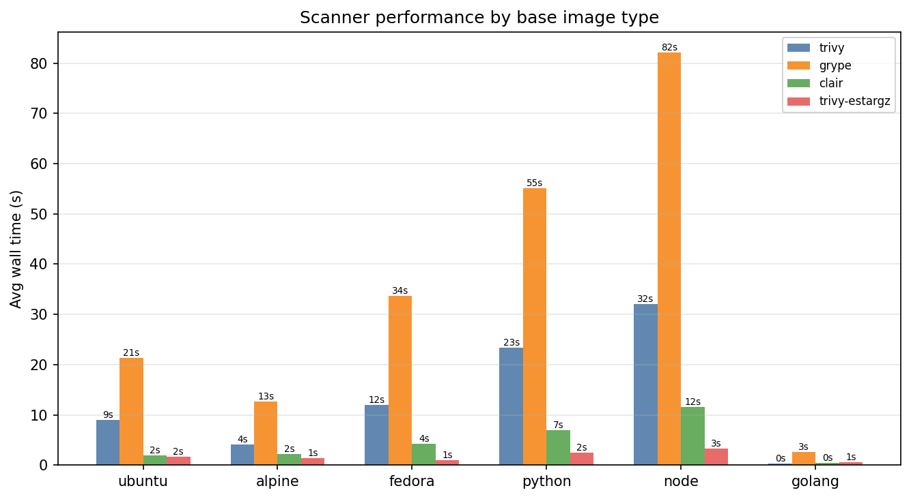
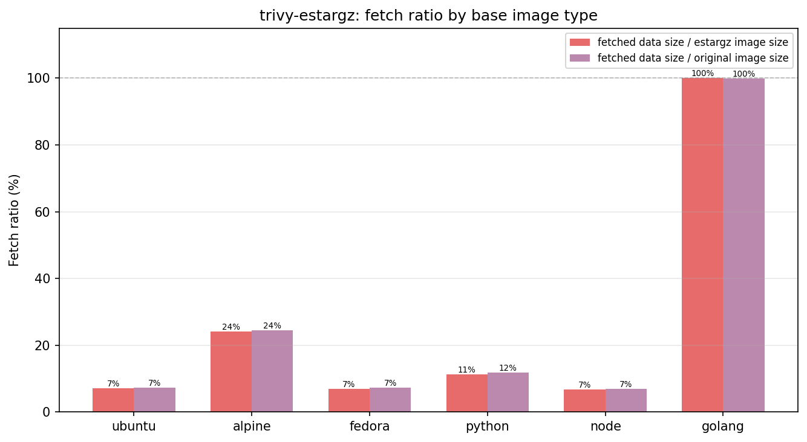
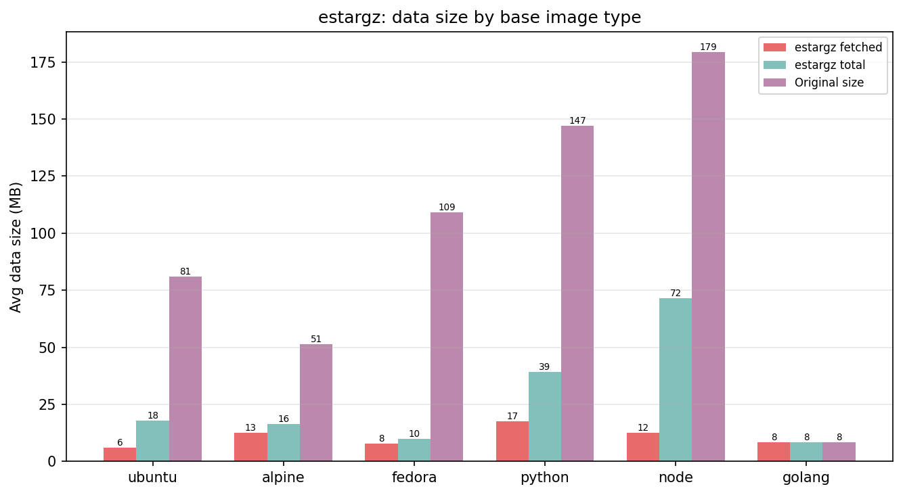

# eStargz + Trivy - результаты

При сканировании образа из container registry стандартный Trivy полностью скачивает и распаковывает каждый слой целиком. В то же время для работы сканера нужно не все содержимое образа - в большинстве случаев интерес представляют лишь отдельные метаданные пакетных менеджеров и манифесты зависимостей

eStargz — формат архива, полностью совместимый с обычным .tar.gz, но позволяющий запрашивать каждый файл по-отдельности. Это достигается упаковкой каждого файла в отдельный gzip-поток и наличием table of contents архива в конце

## Что реализовано

- Форк Trivy с поддержкой eStargz образов - для обхода ФС используется TOC, после чего скачиваются только те файлы, которые требуются включённым анализаторам
- Инструментарий бенчмарка и анализа результатов ([подробнее](benchmark/BENCHMARK.md))
  - генератор образов, моделирующий реальный профиль нагрузки на container registry
  - скрипт конвертации в eStargz
  - benchmark runner для запуска четырёх сканеров (trivy, ванильный trivy-estargz, grype, clair) с измерением времени и объема скачиваемых из registry данных
  - скрипт верификации корректности результатов
  - визуализация результатов в виде графиков

## Результаты экспериментальной оценки

Методология бенчмарка:
- Сгенерировать и загрузить в Harbor тестовый набор из 90 образов
- Загрузить в Harbor eStargz-версии всех образов, предварительно сконвертировав
- Прогнать каждый сканер на полном наборе, перед прогоном полностью очистить кеш

### Производительность

trivy-estargz в 4–10X быстрее обычного trivy, сопоставим по скорости с Clair

### Объём скачиваемых данных

В среднем при использовании trivy-estargz скачивается примерно ~10% от исходного объема образов

### Замечания

- конвертированные в eStargz образы на ~5% тяжелее оригиналов из-за пофайлового сжатия. Это следует учитывать при оценке реального выигрыша в production-сценарии
- разница в проценте скачиваемых данных в зависимости от типа образа объясняется особенностями их структуры:
  - в текущей реализации анализатора Go-модулей нужен весь бинарник целиком, поэтому на scratch-образах со standalone Go бинарником выигрыша нет
  - в образах fedora/alpine, в отличие от ubuntu, `/usr/lib` (содержимое которой не используется при сканировании) занимает меньшую часть образа, и как следствие, процент скачиваемых для анализа данных выше
  - с node ситуация аналогичная - существенную часть образа занимают `node_modules`, поэтому частичная загрузка показывает более высокую эффективность

### Корректность реализации trivy-estargz

Верификация подтвердила совпадение количества и состава уязвимостей между trivy и trivy-estargz
по всем образам и всем категориям severity
