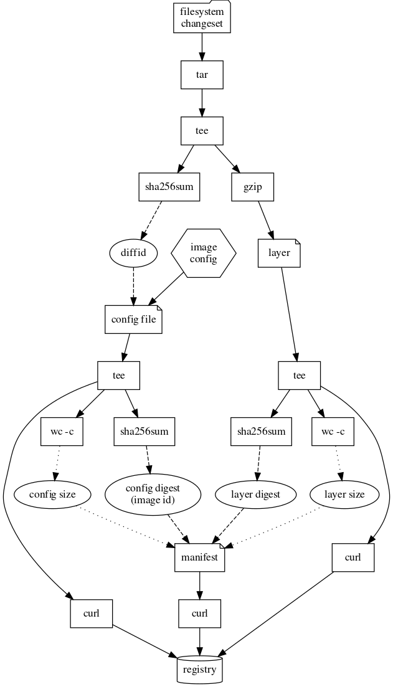

## Карточки с Kaiten

### Рассмотреть существующие решения
- Найти информацию о том, какие инструменты, специализирующиеся на на поиске уязвимостей в образах, уже существуют
- Разобраться в общих принципах их работы. В частности интересуют применяемые механизмы кеширования - может ли инструмент обходиться без анализа образа, если он уже был проанализирован ранее
- Произвести сравнение инструментов по различным параметрам, таким как: скорость работы, потребляемые ресурсы, простота интеграции в существующую инфраструктуру
- Проверить изначальную гипотезу - в случае доверенного реестра образов можно доверять результатам предыдущих проверок и тем самым ускорить проверку, в то время как в общем случае так делать нельзя по соображениям безопасности

#### Наработки:
не было

---

### Разобраться с существующими решениями
- Как сканер работает с образами
- Разобрать, как образ хранится в registry
- Рассмотреть вопрос интеграции сканера с registry (анализ образа в момент загрузки)
- Почему ttl кеша короткий by design в популярных решениях

#### Наработки:

---

Основное направление мысли, которое мы обсудили - хотим максимально эффективно генерировать SBOM. Чтобы это делать максимально эффективно, нужно интегрировать сканер внутрь container registry.

Я обнаружил, что у Harbor есть возможность генерации SBOM сразу после загрузки образа. По умолчанию в Harbor предлагается использовать Trivy или Clair. Я решил изучить Harbor+Trivy - насколько эффективно происходит их взаимодействие.

---

Выяснил, что Trivy в Harbor живет в отдельном контейнере-адаптере и вызывается просто как утилита командной строки. Trivy взаимодействует с registry как с удаленным (буквально ходим в соседний контейнер) и, соответственно, никакой интеграции нет - слои лишний раз скачиваются в контейнер с Trivy

---

В Harbor все данные реестра лежат в виде плоской структуры, которая полностью коррелирует с типами OCI и API взаимодействия с реестром.
Думаю, что для эффективной работы хочется сканировать напрямую эти файлы без тасканий туда сюда между контейнерами

---

Изучив исходники, я обнаружил, что Trivy тем или иным образом получает tar со слоем (что логично). Он пытается достать образ из различных источников:

* Remote - тут без комментариев

* Локальный Docker Engine/containerd - общение происходит через API, соответственно описанное узкое место с перекладыванием слоев все еще присутствует

Больше всего заинтересовала возможность сканировать папку в формате OCI Image Layout - в таком случае, кажется, получается нулевой оверхед. Тем не менее, в container registry этот формат не используется

(при использовании Docker Engine/containerd у них фактически запрашивается tar с OCI Image Layout. Поэтому Remote выглядит в каком-то смысле даже более легковесным - он запрашивает все обьекты напрямую)

---

При анализе уязвимостей Trivy внутри Harbor никак не использует заранее сгенерированный SBOM

Возможные причины (скорее даже гипотезы):

* Форматы SBOM (CycloneDX, SPDX) не позволяют сохранить всю информацию, извлекаемую Trivy из образа

* Нет устоявшихся стандартов/API для хранения и получения SBOM из реестра

* Повторный запуск индексирования образа (например, новой версией сканера) может оказаться более полным

В Trivy есть экспериментальная возможность использовать SBOM (--sbom-sources), но она не используется

В этом плане Clair выглядит более перспективным - в нем явно разделены этапы индексирования образов (Indexer) и сканирования уязвимостей (Matcher). Однако формат результата индексирования свой собственный и хранится в БД - кажется, у него вполне себе долгий TTL (но на практике я это пока не проверил)

---

### Разобрать формат OCI-образов

Необходимо проанализировать формат OCI-образов, посмотреть, какие существуют атрибуты образа/слоя, попробовать понять, как их можно использовать для поиска по базе данных известной информации об образах (с целью эффективного выявления известных уязвимостей)

#### Наработки:

---

Неформальная сводка:

* образ=корневая ФС контейнера

* состоит из набора диффов (**слоев**)

* Образ неизменяемый, потому что все провязано дайджестами

  * Но при обращении к реестру с именем и тегом может быть отдан другой образ - надо проверять ImageId, либо обращаться к манифесту по его дайджесту

Метаинформация сама по себе никак не поможет в установлении содержимого образа

---

Формально по документации:

**OCI образ** состоит из:

* Манифеста образа

* Image index (optional) - может задавать различные реализации образа (например в зависимости платформы и архитектуры) со ссылками на разные манифесты

* Слоев

* Конфигурации

**Дескриптор** ссылается на произвольные данные, может быть, с указанием источника. Состоит из:

* Типа данных, на которые он ссылается

* Размера

* Digest (контрольная сумма и уникальный идентификатор данных одновременно)

* Набора ссылок, по которым данные можно скачать (опционально)

**Манифест образа** состоит из:

* Дескриптора конфига образа

  * Digest конфига = **ImageID** (как я понял)

* Набора дескрипторов слоев (сами слои - tar или tar.gz архивы)

**Конфигурация образа** сотоит из:

* Всяких стандартных вещей, которые можно задать при создании образа

* Описания корневой файловой системы

  * Список контрольных сумм слоев (Layer DiffId)

**Container registry** определяет ручки скачивания и загрузки произвольных **манифестов** (манифест образа/image index) и **блобов** (бинарных данных слоев)

* /v2/<name>/manifests/<reference>

  * Name - имя образа (library/ubuntu)

  * Reference - тег или digest

* /v2/<name>/blobs/<digest>

Соответственно, пулл образа - запрос всех необходимых данных через эти ручки (манифест/конфиг/слои/…)

---

Красивая картинка о том, что как собирается и пушится в registry:

